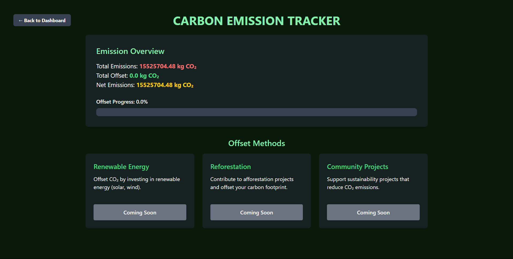

# EVERA - Carbon Emission Tracker

A comprehensive web platform designed to help large-scale companies **calculate**, **track**, and **offset** their carbon emissions based on their shipment data.

---

##  Overview

This tool enables companies to compute their carbon footprint based on shipment **weight**, **distance**, and **transport mode** (road, rail, air, or sea). It offers data visualizations to monitor emissions trends, a green score system to track performance, and options to offset emissions through eco-friendly initiatives.

---

##  Features

-  **User Authentication** 
-  **Personalised Dashboard** 
-  **Estimate CO₂ emissions** without user auth (for anyone to play around and see how different modes and weights of shipment cause emissions)
-  **Calculate CO₂ emissions** from shipment data and record it in a secured db
-  **Visualize data** using Google Charts:
  - Emissions by transport mode (Bar Chart)
  - Emissions over time (Line Chart)
-  **Green Score** Displays green score with leaderboard
-  **Offset emissions** through various ways like using remewable energy and reforestation (in progress)
-  **Certifications** for companies to upload their certificates which will be displayed on their dashboard and to the public after verification (in progress)
-  **Badges**  Custom badges awarded to companies when they reach milestones ehich will be displayed on they dashboard (in progress)


---

## Tech Stack

- **Frontend**: HTML, CSS, Tailwind CSS, JavaScript  
- **Backend**: Python, Flask  
- **Database**: SQLite + SQLAlchemy  
- **Charts & Visualization**: Google Charts  

---

##  How to Run Locally

1. **Clone the repository**
   ```bash
   git clone https://github.com/neharamiah/evera.git
   cd evera

2. **Set up virtual environment and install dependencies**
   ```bash
   python -m venv venv
   source venv/bin/activate          # On Windows: venv\Scripts\activate
   pip install -r requirements.txt

3. **Run the Flask App**
    ```bash
    python app.py

4. **Visit**
    Open your browser and go to: http://localhost:5000


5. **Reccomended**
    login with the following credentials to have a better data set and experience.
    email id : amazin@gmail.com
    pwd : amazin

## Screenshots



